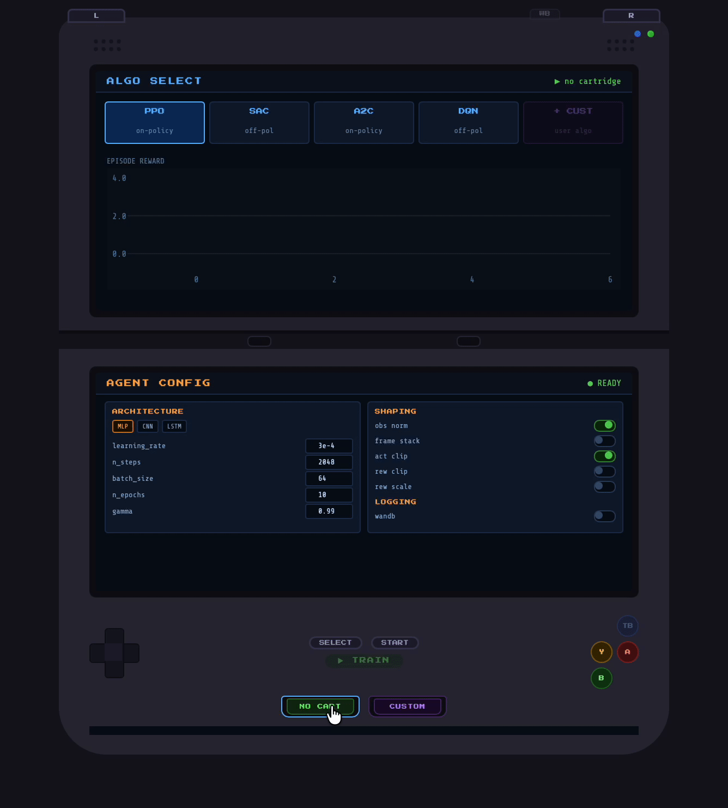

# 🎮 RL Trainer DS

A Nintendo DS-styled graphical interface for training reinforcement learning agents — because why use a boring dashboard when you can use a handheld console?

Built with [Dash](https://dash.plotly.com/), [Plotly](https://plotly.com/), [Stable-Baselines3](https://stable-baselines3.readthedocs.io/), and [Gymnasium](https://gymnasium.farama.org/).


<!-- Record a GIF of the full interface and save it as assets/demo.gif -->

---

## Features

- **Cartridge slot** — load any standard Gymnasium environment or your own custom env from a file path
- **Dual screen layout** — algorithm selection + live training curves on top, agent config on bottom
- **Algorithm selector** — PPO, SAC, A2C, DQN, and custom SB3-compatible algorithms
- **Hyperparameter editor** — per-algorithm parameter panels with sensible defaults
- **Observation, action and reward shaping** — toggle normalization, frame stacking, clipping, and scaling
- **Live training curves** — episode reward vs timestep updated every 500ms, auto-scaling axes
- **TensorBoard integration** — launches automatically on training start, one-click access via the TB button
- **Weights & Biases integration** — optional wandb logging with project and run name config
- **Custom environment support** — point to any `.py` file containing a `gymnasium.Env` subclass
- **Custom algorithm support** — point to any `.py` file containing an SB3 `BaseAlgorithm` subclass

---

## Installation
```bash
git clone https://github.com/your-username/rl-trainer-ds.git
cd rl-trainer-ds
pip install -e .
```

With optional Weights & Biases support:
```bash
pip install -e ".[wandb]"
```

**Requirements:** Python 3.10+

---

## Usage

Launch the app:
```bash
rl-trainer-ds
```

Then open [http://localhost:8050](http://localhost:8050) in your browser.

### Basic workflow

1. **Load a cartridge** — click the green cartridge slot at the bottom and select a Gymnasium environment from the library, or type a custom env ID
2. **Select an algorithm** — click one of the algo cards on the top screen (PPO, SAC, A2C, DQN, or CUSTOM)
3. **Configure the agent** — adjust hyperparameters, architecture (MLP / CNN / LSTM), and shaping options on the bottom screen
4. **Train** — hit the **▶ TRAIN** button; the top screen switches to a live reward curve
5. **Monitor** — click the **TB** button to open TensorBoard in a new tab

---

## Custom Environments

Point the purple cartridge slot to any `.py` file containing a `gymnasium.Env` subclass:
```python
# examples/custom_env.py
import gymnasium as gym
import numpy as np
from gymnasium import spaces

class MyCustomEnv(gym.Env):
    def __init__(self):
        super().__init__()
        self.observation_space = spaces.Box(
            low=-1.0, high=1.0, shape=(4,), dtype=np.float32
        )
        self.action_space = spaces.Discrete(2)

    def reset(self, seed=None, options=None):
        super().reset(seed=seed)
        obs = self.observation_space.sample()
        return obs, {}

    def step(self, action):
        obs = self.observation_space.sample()
        reward = float(action == 0)
        terminated = bool(np.random.rand() < 0.05)
        return obs, reward, terminated, False, {}

    def render(self): pass
```

The app detects the subclass automatically, registers it with Gymnasium, and makes it available as a cartridge. No boilerplate required.

---

## Custom Algorithms

Point the CUSTOM algo card to any `.py` file containing an SB3-compatible `BaseAlgorithm` subclass:
```python
# examples/custom_algo.py
from stable_baselines3 import PPO
from stable_baselines3.common.base_class import BaseAlgorithm

class MyCustomAlgo(PPO):
    """
    A minimal custom algorithm extending PPO.
    Override learn(), predict(), or _setup_model() for deeper customisation.
    """
    def __init__(self, policy, env, learning_rate=3e-4, **kwargs):
        super().__init__(
            policy=policy,
            env=env,
            learning_rate=learning_rate,
            **kwargs
        )
```

Once loaded, the CUSTOM card activates and exposes a free-form JSON parameter editor for passing kwargs to your algorithm's constructor.

---

## Project Structure
```
rl_trainer_ds/
├── app.py              # Dash app entry point
├── layout.py           # Full DS layout definition
├── callbacks.py        # All Dash callbacks
├── training/
│   ├── runner.py       # TrainingState, background thread, SB3 callback
│   ├── wrappers.py     # Gymnasium obs/action/reward shaping wrappers
│   └── custom_loader.py# Dynamic loading of custom envs and algos
├── assets/
│   └── ds_style.css    # Nintendo DS shell styling
examples/
├── custom_env.py       # Example custom Gymnasium environment
└── custom_algo.py      # Example custom SB3 algorithm
pyproject.toml
README.md
```

---

## TensorBoard

TensorBoard launches automatically when training starts, logging to `./tb_logs`. Click the **TB** button (face button, top-right of console) to open it. Logs are organised by `env_id/algo_name/timestamp`.
```bash
# Or launch manually
tensorboard --logdir ./tb_logs
```

---

## Weights & Biases

Enable the **wandb** toggle in the LOGGING section of the bottom screen before hitting TRAIN. Set a project name and run name — defaults to `rl-trainer-ds` and `{env_id}_{algo}` respectively.

Requires a wandb account and `wandb login` before first use.

---

## Notes

- Training runs in a background thread. The Dash app is single-process; do not deploy with a multi-worker server (gunicorn `-w 2+`) as shared training state will break.
- TensorBoard is launched as a subprocess on port 6006 and shut down cleanly on app exit via `atexit`.
- Custom env and algo files are loaded with `importlib` at runtime — make sure their dependencies are installed in the same Python environment.

---

## License

MIT
